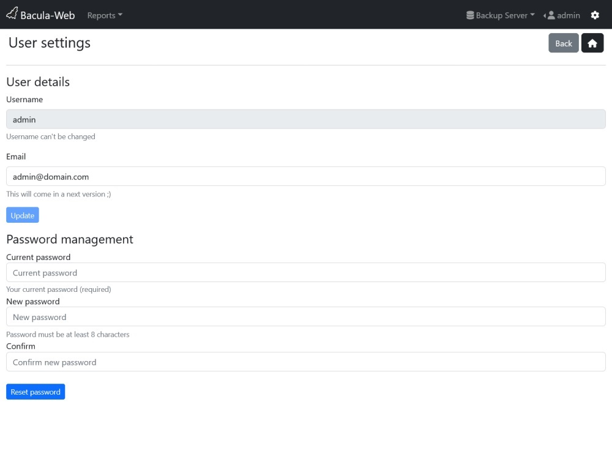
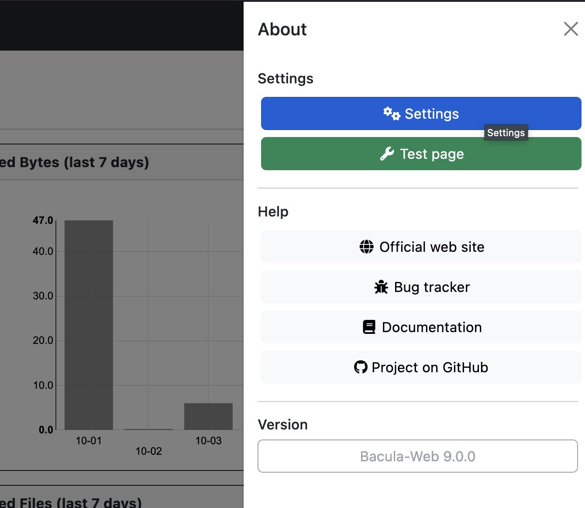

# Setup user authentication

## Overview

Starting from version 8.0.0, users information are stored in SQLite database.

To be able to sign in into Bacula-Web, you'll need to create the first user

:::info
The users database is stored in `<install folder>/application/assets/protected/application.db`
:::

## User creation

```shell
$ cd /var/www/html/bacula-web
```

import Tabs from '@theme/Tabs';
import TabItem from '@theme/TabItem';

<Tabs>
  <TabItem value="rpm" label="On Red Hat / Centos / Fedora" default>
```shell
$ sudo -u apache php bwc setupauth
```
  </TabItem>
  <TabItem value="deb" label="On Debian / Ubuntu">
```shell
$ sudo -u www-data php bwc setupauth
```
  </TabItem>
</Tabs>

Answer the questions, and if everything goes fine, you should be able to sign in

:::warning
The user password must be at least 8 characters long
:::

## Reset user password

The password can be changed very easily by using the **User settings** menu at the top of the page.

Simply use **Password management** form to reset current user password



## Manage users

You can manage users from the **Settings** menu in the dropdown menu.



To add more users, simply use the **Add user** form at the bottom of the page (password must be at least 8 characters long).


:::info
User's email address is not used for the moment, but it will in a future version
:::
