# Features

## Features overview

### Install once, monitor several directors

You just need to Install Bacula-Web once, then monitor as much Bacula directors you have.

Bacula-Web give you the ability to keep an eye on all your Bacula directors from a single point.
You can Install it on a dedicated server and manage all your Bacula instances from a single Bacula-Web instance.

### Keep an eye on Bacula events and resources

Bacula-Web Dashboard provide an overall overview of your Bacula jobs, Volumes, Pools, Catalog statistics, Amount of Bytes/Files protected by Bacula, etc..

You can choose within predefined period like last 24 hours, last week, last month or since beginning of time period.

### Bacula-Web in your language

Bacula-Web come by default in english but, with the help of the community, it has been translated in several languages listed below

* Belarusian
* Catalan
* German
* Spanish
* French
* Italian
* Japanese
* Dutch
* Norwegian
* Polish
* Portuguese (Brazil)
* Russian
* Swedish
* Chinese

Translations are a work in progress, if you want to contribute, please read the [How to contribute to translations](/docs/contribute/translations.md) page

:::tip
A huge thanks to the community for his help translating Bacula-Web :)
:::

### Jobs report page

The jobs report page shows you Bacula jobs with several ordering and filtering options.
Another useful feature is that you can check log or each jobs and jump to **Backup job report** page from any backup job.

### Client backup report

Client backup report provide you for each Bacula client the details below

* client os, client architecture, client version
* display last known completed backup job
* last x days stored bytes and files graphs

### Backup job report

Backup job report display useful information about Bacula jobs like

* last completed jobs
* last x days stored bytes and files graphs

### Job files report

Job files report list all files and folder backed up by a backup job

:::info
Since Bacula-Web 8.4.0, you can filter the file(s)/folder(s) list using a search box
:::

### Pools and volumes

Pools and volumes provide you a list of all Bacula pools and assigned volumes with details like volume name, Bytes, Media type, expiration date, last written date, status

### Directors

The directors report display basic information about all Bacula catalog you have configured

### Authentication

Users authentication is enforced by default, storing user information in a locale database with encrypted (hashed using Bcrypt) passwords.

This ensures that only authorized users can access the Bacula infrastructure information,
providing better security and control over the data.

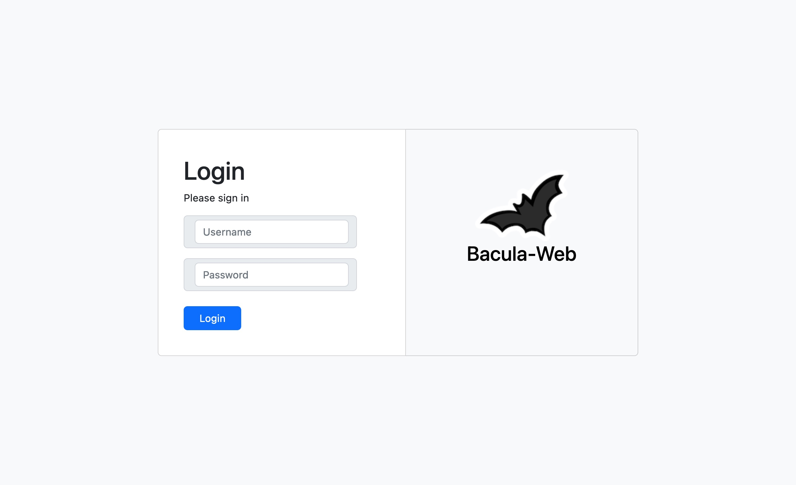

Users won't be able to connect until they provide valid credentials.

The login form does require a valid username and password.

The username must be only composed of alphanumeric characters.

| Field    | Valid          | Invalid   | Description                                             |
|----------|----------------|-----------|---------------------------------------------------------|
| Username | `johndoe`      | `john#25` | only of alphanumeric characters are accepted (Aa-Zz0-9) |
| Password | `Ohngoo0alohz` | `john123` | password must be at least 8 characters long             |

If the username or password does not comply with above described rules, the login form display
validation errors as you see below.

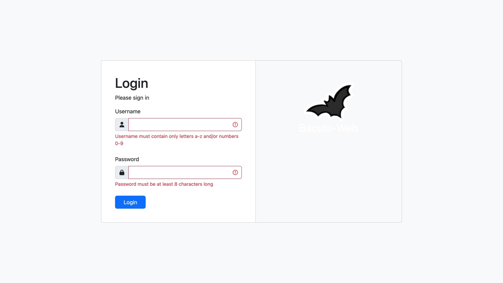

### Test page

Test page give you some useful information about your Bacula-Web installation and configuration

## Features list

### Dashboard

Bacula-Web Dashboard provide a lot of information about your Bacula infrastructure

* Last period job status (display backup jobs status for the current period)
* Jobs status, transferred files / bytes for the current period
* Stored bytes graph (last 7 days)
* Stored files graph (last 7 days)
* Pools and volumes usage graph
* Last used volumes (display last 10 used volumes for backup jobs)
* Client jobs total (backup and restore jobs statistics)
* Weekly jobs statistics (backup jobs statistics for each doy of the week)
* Biggest backup jobs

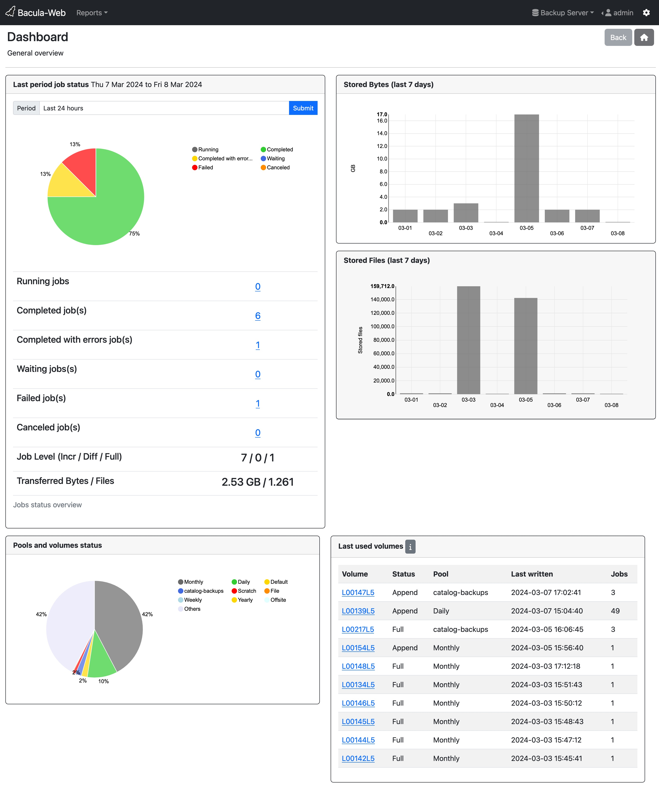

### Jobs report

Jobs report page display Bacula jobs in a paginated table format.

Jobs report display latest Bacula jobs (backup,copy,restore) in a table format containing useful information like

* Job status
* Job ID
* Client Name
* Job type
* Start, end time and elapsed time in a "human" readable format
* Level of backup jobs (Full, Incremental, Diff)
* Bytes and Files for backup jobs
* Speed average for completed backup jobs
* Compression rate
* Pool
* Job logs
* Jobs can be ordered by job id, job bytes, job files, job name, pool name
* Jobs can filtered for a specific client or by job status

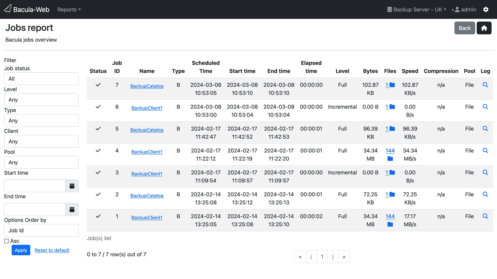

### Job logs

Job logs can be displayed by clicking on the loop icon off each job

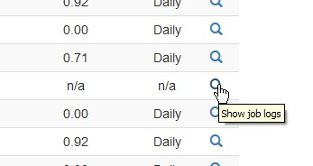

### Job filter and options

You can use different filter and ordering options

import JobReportOption from '../assets/bacula-web-jobs-report-options.jpg';

### Job logs

The Job logs page display

* logs for all kind of jobs (backup, restore, copy, etc.) available from Job reports page
* show time and logs information (useful for troubleshooting backup problems)

### Pools

List all configured Bacula pools with information like

* Pool name
* Volume(s) count
* Total bytes

You can display associated volumes of each pool by clicking on **Show volumes** button.

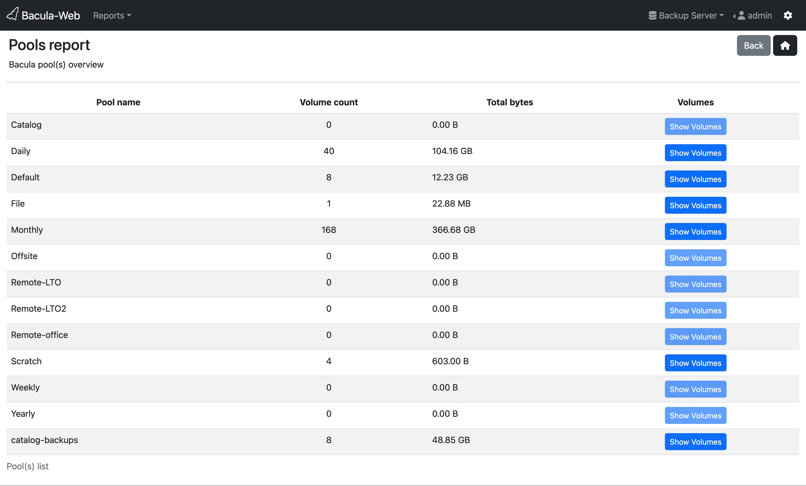

### Volumes

List all volumes with details like

* Volume name (by clicking on the link, it display the volume details report)
* Bytes
* Jobs
* Media Type
* Pool
* Expire
* Last written
* Status
  icon can change based on volume usage (full, append, etc.)
* Slot
  If you use a physical tape auto-changer / library, this could be pretty useful :)
* In changer
  If you use a physical tape auto-changer / library, you will know if the volume is inside or outside the library

The total of bytes and number of volumes is displayed at the bottom of the page

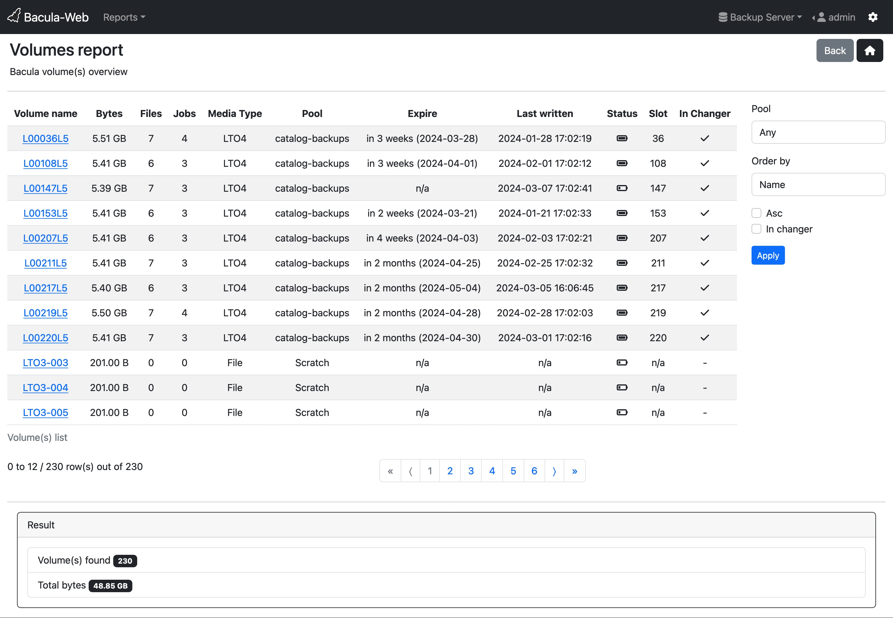

### Volume details

Display volume details such as

* Media Id
* Volume Name
* Volumes Bytes
* Volumes file(s)
* First written date/time
* Last written date/time
* Media Type
* List of backup jobs stored on the volume
* Slot
* In changer status
* Mounts

:::info
Available since v8.7.0
:::

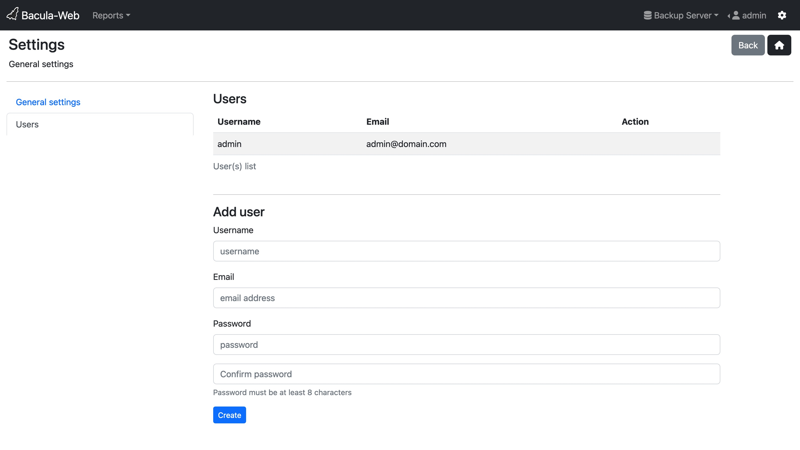

### Backup jobs report

Display useful information like last 7 days stored bytes and files

* last completed jobs
* last x days stored bytes and files graphs

You can choose different periods such as last

* week
* 2 weeks
* month

:::info
Since Bacula-Web 8.3.0, if you click on backup job files value, it will display the job files report (list backup job files)
:::

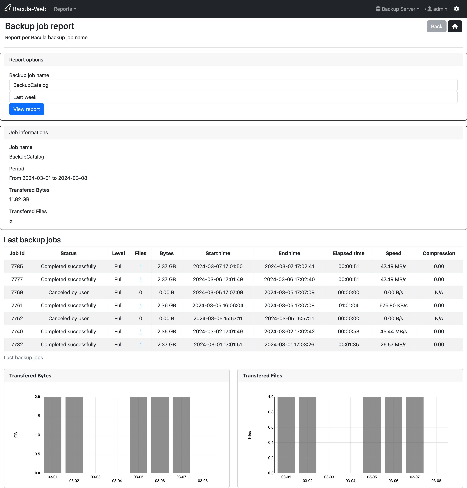

### Clients backup report

Show information like

* Client name
* Client os
* Client architecture
* Client version
* Last known completed backup job
* Last x days stored bytes and files graphs

You can choose different periods such as last

* week
* 2 weeks
* month

### Directors

The Bacula director(s) report page display useful details of each Bacula director(s) you have set in the configuration

Bacula director details are

* Number of client(s)
* Defined job(s)
* Total bytes
* Total files
* Database size (size of Bacula catalog)
* Number of volume(s)
* Volume(s) size (used disk space for all volumes)
* Number of pools
* Number of filesets

:::info
This feature is available since version 8.0.0-RC1
:::

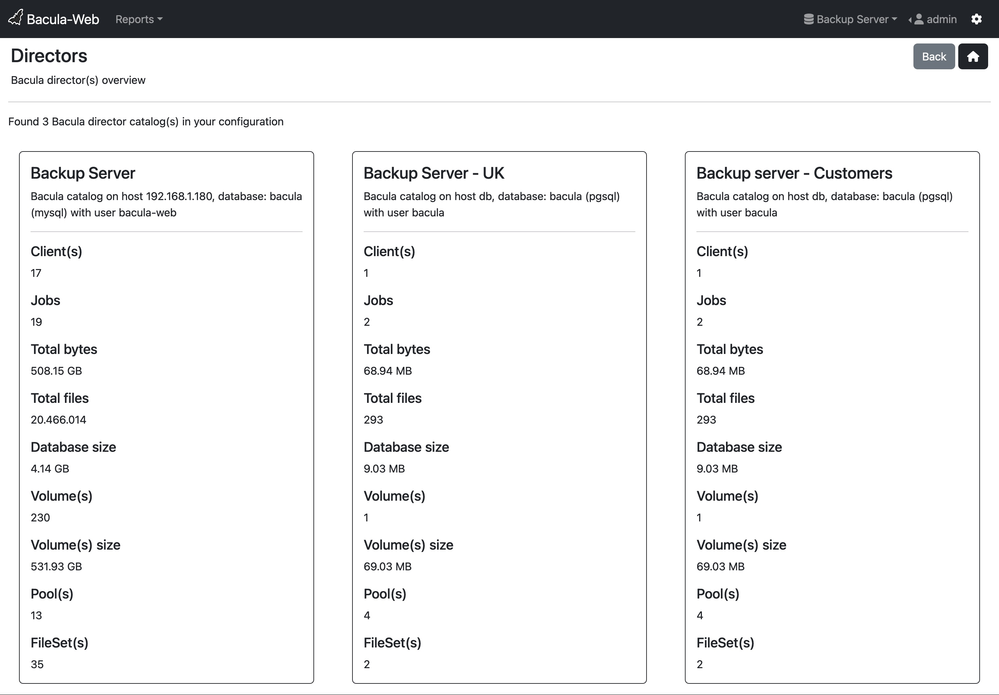

### Job files

This report list all files of a Bacula backup job with pagination.

:::info
This report is available since Bacula-Web 8.3.0
:::

### Test page

This is the page you'd use after installing Bacula-Web for the first time or if you need to make sure that your installation will work as expected.

The test page do the following check for you

* PHP - gettext support (uses for translation)
* PHP - session support (used in the Core php code)
* PHP - MySQL support
* PHP - PostgreSQL support
* PHP - sqlite support
* PHP - PDO support
* PHP timezone setting
* Bacula catalog database connection (must be improved)
* Twig cache folder permissions (required for page rendering purpose)
* Protected assets folder permissions
* PHP version (version 8.0 at least is supported)

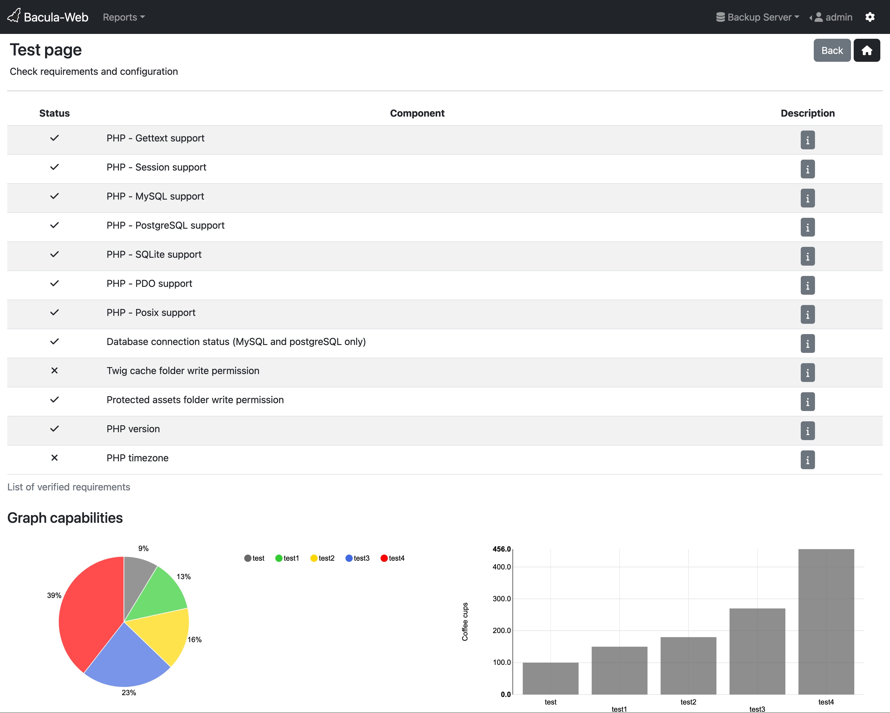

### General settings

The general settings page shows you current settings defined in **application/config.php**

For now, it's in read only mode but you might be able to update the configuration using this
page in a future version.

:::info
This feature is available since version 8.0.0-RC3
:::

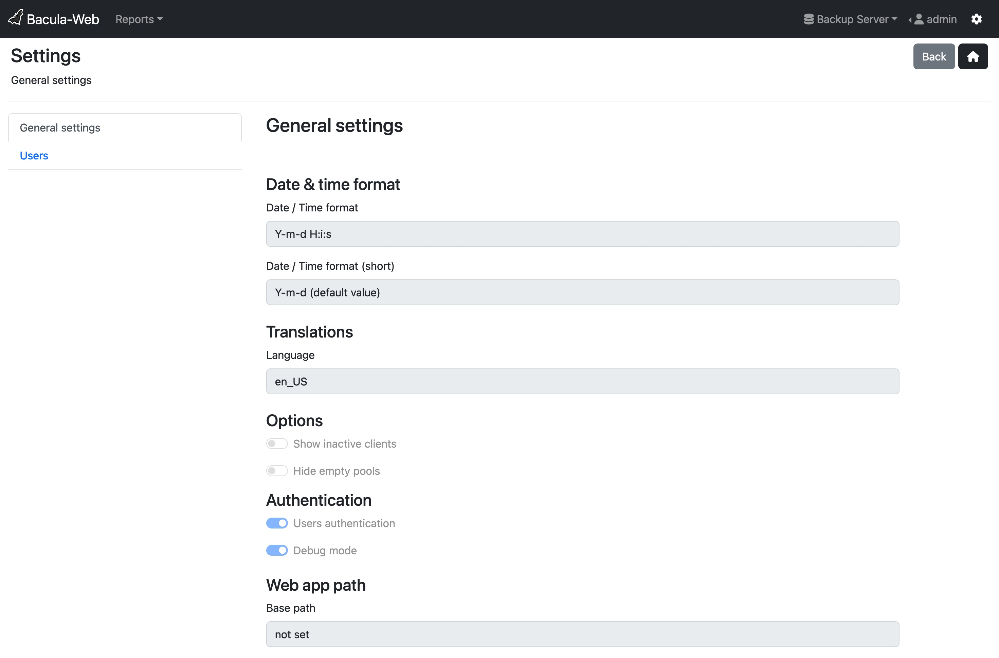

### User settings

The user settings page display in read-only mode current user settings and details.

It also allow each users to reset their own password.

:::info
This feature is available since version 8.0.0-RC3
:::

## Known limitations

As of now, Bacula-Web is only a reporting and monitoring tool, it only access your Bacula director (read only) to retrieve information from Bacula catalog.

I have plan to include more features such as starting, canceling backup or restore jobs for example.
This will come in the future but you'll need to be patient as the whole application code needs to be rewritten.
